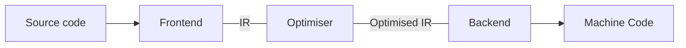

WebAssembly is statically typed and precompiled, and thus it provides better performance than JavaScript.

A compiler has 3 components:

- #### Front end:
	- Needs to understand the source language
	- Checks source code for syntax issues
	- Converts source code to an intermediary representation (IR) (Compiler's version of the source code)
- #### Optimiser:
	- the optimiser analyses the IR and transforms it into a much more efficient one.
	- Few compilers have multiple IRs
	- The optimizer is an IR-to-IR transformer
	- The optimizations here include removing redundant computations, eliminating dead code (code that cannot be reached), and various other optimizing options.
	- the optimizers need not be language-specific. Since they act on the IR, they can be built as a generic component and reused with multiple languages.
- #### Backend:
	- The backend focuses on producing the target language.
	- The backend receives the generated (optimized) IR and converts it into another language (such as machine code).
	- This machine code is the actual code that runs on the bare metal. In order to produce efficient machine code, the backend should understand the architecture in which the code is executed.

### ISA (Instruction Set Architecture)
- An instruction set is a set of operations supported by a processor, and this overall design is called an **Instruction Set Architecture** (**ISA**).
- Various processors convert the ISA in different implementations.
- The ISA is an interface between the hardware and the software.

Example: How the Intel x64 architecture adds two numbers using its Instruction Set Architecture (ISA)?

In x64 assembly language, adding two numbers is typically done with the following steps:
1. **Load the Numbers:** The first step is to load the numbers you want to add into CPU registers. Registers are like small, super-fast storage spaces inside the computer's brain. You might load the first number into one register (let's call it Register A) and the second number into another register (Register B).
    
2. **Perform the Addition:** Now that you have the numbers in registers, you use an addition instruction provided by the ISA. In x64 assembly, this instruction is usually called "add." You tell the computer to add the contents of Register A and Register B together.
    
3. **Store the Result:** After the addition, the result is stored in another register or in memory. This is where you'll find the answer to your addition.
4. Here's a simplified example in x64 assembly code:
   <code>
	   <pre>
	   ; Load the first number (e.g., 5) into Register A
		mov rax, 5
		
		; Load the second number (e.g., 7) into Register B
		mov rbx, 7
		
		; Add the contents of Register A and Register B and store the result in Register C
		add rax, rbx
		
		; Now, the result (12) is in Register A (rax)
		</pre>
   </code>